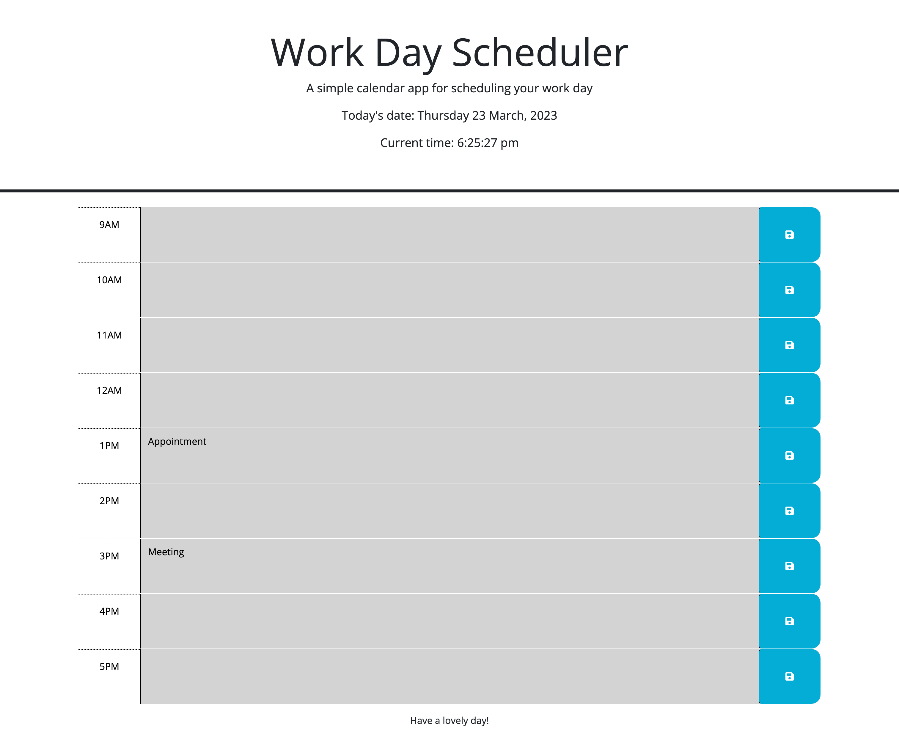

## Project Title

Isabel's Word Day Scheduler

## Project Description

This work day scheduler allows the user to see their work day broken down into hourly time blocks. Each hourly block has a text input area where the user can add a task or appointment, and save it to the local storage. On refresh, the tasks will remain so the user can plan their day accordingly. The hourly blocks are colour coordinated, so that the current hour is displayed in red, the future hours are green, and past hours are grey. 

## Credits

Based off starter code provided from Monash University. 

## Mock-Up

The following image shows the web application's appearance and functionality:

## Installation & Links

Deployed Application: [isabelkvaughan.github.io/work-day-scheduler](https://isabelkvaughan.github.io/work-day-scheduler/)

GitHub Repository: [github.com/isabelkvaughan/work-day-scheduler](https://github.com/isabelkvaughan/work-day-scheduler)

GitHub profile: [github.com/isabelkvaughan](https://github.com/isabelkvaughan)

## Contact

Isabel Vaughan 
https://www.linkedin.com/in/isabel-vaughan-b68984bb/